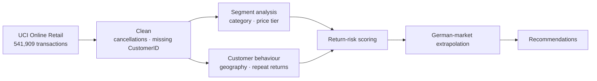

<!-- structure: metric-first impact sheet -->
# Return Rate Analysis — E-Commerce Risk Segmentation
> 🚧 **Work in progress** — research question, dataset, and methodology below are locked. The analysis notebooks and cleaned datasets are being finalised and will be committed here shortly.


What product categories, price ranges, and customer segments drive the highest return rates? Analysed using UK retail data in the context of Germany's €92B e-commerce market, where returns exceed 50% in fashion.

| Status | Dataset | Scope | Business Impact |
|--------|---------|-------|-----------------|
| In Progress | UCI Online Retail | 541,909 transactions (2010–2011) | Germany: €2.6B annual return losses |

---

## The Problem

Germany is Europe's highest-return e-commerce market. With €92.4 billion in online sales (2025) and return rates exceeding 50% in fashion, retailers lose an estimated €2.6 billion annually on fashion returns alone. Each return costs €5–10 in logistics and processing.

**Question:** Which product categories, price ranges, and customer segments are the highest-risk segments?

---

## Dataset

**Source:** UCI Machine Learning Repository — Online Retail Dataset  
**URL:** [archive.ics.uci.edu](https://archive.ics.uci.edu/dataset/352/online+retail)

| Property | Value |
|----------|-------|
| Records | 541,909 transactions |
| Period | 2010–2011 |
| Countries | Primarily UK; 4,372 international |
| Features | 8 (InvoiceNo, StockCode, Description, Quantity, InvoiceDate, UnitPrice, CustomerID, Country) |
| Data quality | Missing CustomerID (24.8%), negative Quantity (cancelled orders) |

---

## Architecture



> Planned pipeline — this repo is a work in progress; notebooks and cleaned data land here as they are finalised.

## Analysis Outline

- **Segment analysis:** Return rates by product category and price tier
- **Customer behavior:** Geographic patterns and repeat-return profiles
- **Business context:** Extrapolation to German market conditions
- **Recommendations:** Category-level risk mitigation and pricing strategies

---

## Reproduce

```bash
git clone https://github.com/kandulanikhilvarma/return-rate-analysis.git
cd return-rate-analysis
pip install -r requirements.txt
```

_Notebooks and cleaned data are being finalised and will be committed here shortly._

---

## Data & Attribution

Source data is the **Online Retail** dataset from the UCI Machine Learning
Repository (Chen, 2015), distributed under the
[Creative Commons Attribution 4.0 (CC BY 4.0)](https://creativecommons.org/licenses/by/4.0/)
license.

> Chen, D. (2015). *Online Retail* [Dataset]. UCI Machine Learning Repository. https://doi.org/10.24432/C5BW33

Analysis code in this repository is released under the MIT License (see
[LICENSE](LICENSE)); the source data remains under its original terms.

---

## License

MIT License. See [LICENSE](LICENSE) for details.
